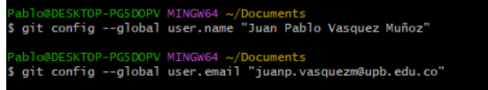
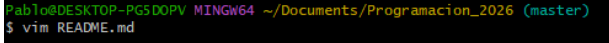

# Conceptos Aprendidos de Git
En esta sección vamos a ver los   conceptos aprendidos para usar la consola, crear directorios y archivos

## Listado de comandos principales

- pwd: es un comando para saber en qué directorio o lugar me encuentro actualmente.

- ls: es un comando para saber los archivos que hay en repositorio.

- cd (change directory): es para cambiar de directorio.

- git config --global user.name "NAME": con este comando agregas en la configuracion tu nombre como usuario y al mismo tiempo cambiando user.name por user.email puedes agregar el correo.

- mkdir: es para crear carpetas

- touch: sirve para crear archivos

- vim: es un editor de codigo

- git add: sirve para subir el archivo al stage

Cuando se sube al archivo al stage se puede verificar su estado con el comando **git status**

luego de verificar el estado del archivo subimos el archivo al commit con el comando **git commit -m "Texto"**

Estos son algunos comandos de la consola.